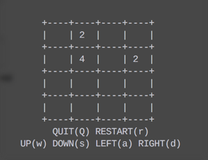

# Read Me
Some tools or something funny.

### 2048.py
A 2048 in command line.

### line counter
A tool used to count file lines in folders.

### iconConvert
Convert big image to small icons.

### Image2Char
Convert a image to ascii art.